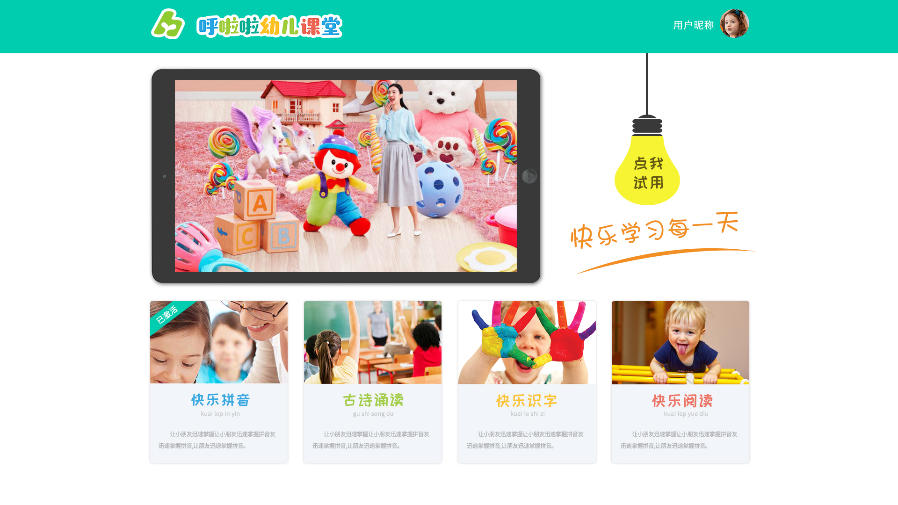

# Youerketang Educational Platform

> Have convenient interface and smooth design, redundant resources for education.
>
> Supports self learning for Primary Schools.
>
> Supports Android and iOS Mobile learning.

## Server Environment

1. PHP 7.0+
3. Nginx
4. MySQL

## Installation Guide

```sh
Main Service Folder for PHP : backend

MySQL Dump File : hllyekt_db.sql

Android Package : Youerketang.apk

iOS Package : Youerketang.ipa
```

## Site Overview



> Live Site : http://hllyekt.hulalaedu.com
>
> Contact Developer Email : gong.fei@outlook.com